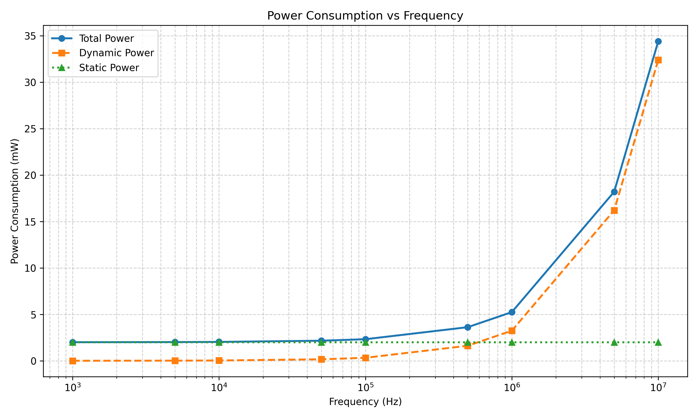
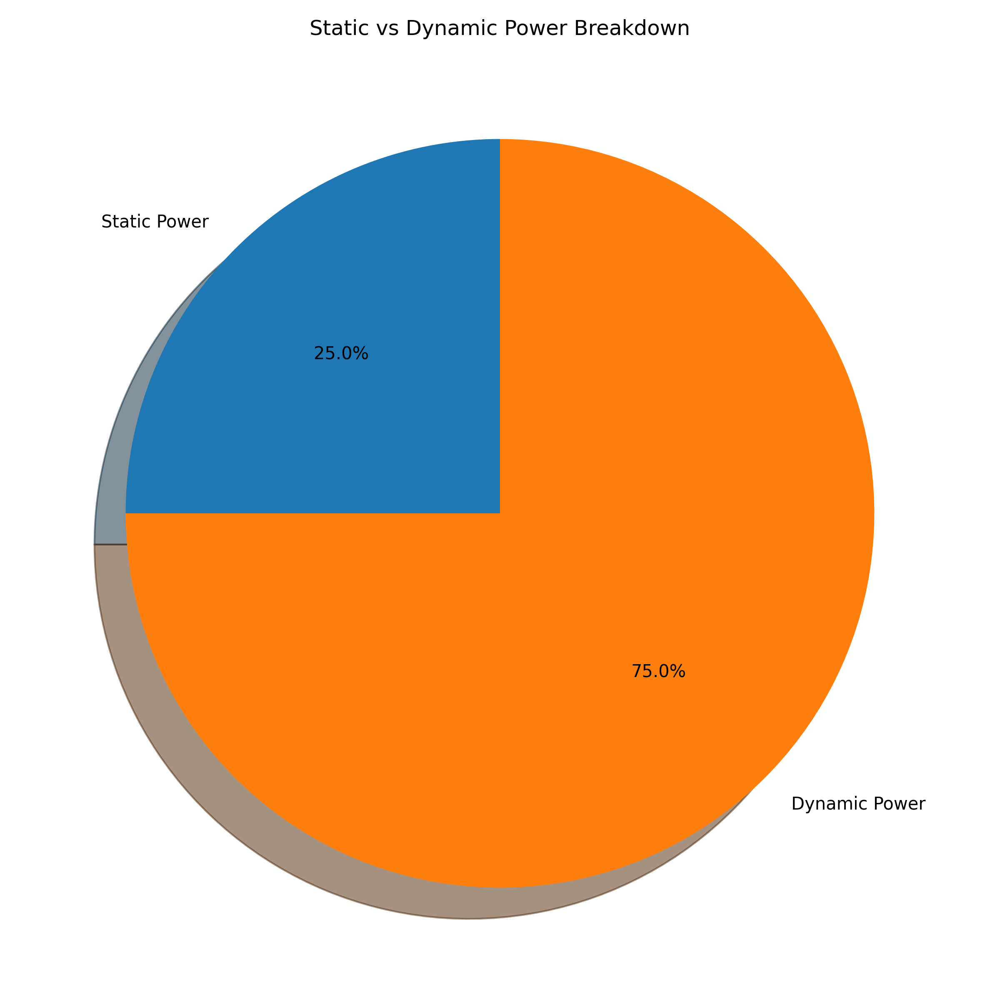
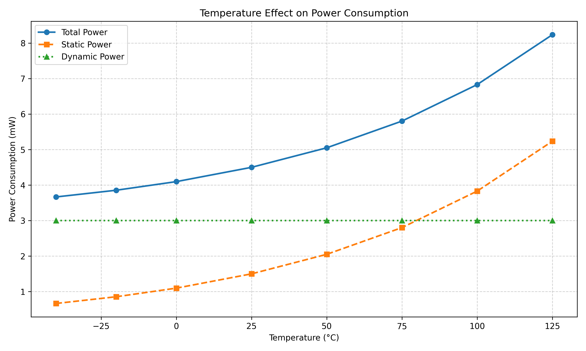

# Power Consumption Analyzer

A Python-based LTspice power analysis tool that processes simulation output data to analyze circuit power consumption across frequency and temperature.

## Overview

The **Power Consumption Analyzer** combines LTspice simulation data with Python-based data analysis to evaluate circuit power behavior. It analyzes static and dynamic power, studies frequency and temperature effects, visualizes power trends, and automatically generates engineering reports.

## Key Features

- Parse LTspice simulation output files
- Analyze power consumption across operating frequencies
- Separate static and dynamic power
- Analyze temperature-dependent power behavior
- Generate power vs frequency visualization
- Generate static vs dynamic power breakdown
- Generate temperature vs power analysis
- Generate automated technical power report
- Generate power summary CSV
- Organize simulation data and analysis outputs

## Technologies Used

- **Python**
- **Pandas**
- **NumPy**
- **Matplotlib**
- **LTspice**

## Project Structure

```text
Power-Consumption-Analyzer/
│
├── power_analyzer.py
├── requirements.txt
├── README.md
│
├── ltspice_outputs/
│   ├── frequency_power.csv
│   ├── static_dynamic_power.csv
│   └── temperature_power.csv
│
└── output_reports/
    ├── power_vs_frequency.png
    ├── power_breakdown_pie.png
    ├── temperature_effect.png
    ├── automated_power_report.txt
    └── summary_table.csv
```

## Power Analysis

The analyzer evaluates three major aspects of circuit power consumption:

### Dynamic Power

Dynamic power is related to switching activity and operating frequency.

```text
Pdynamic = α × C × V² × f
```

where:

- α = switching activity factor
- C = load capacitance
- V = supply voltage
- f = operating frequency

### Static Power

Static power primarily represents leakage-related power consumption.

```text
Pstatic = Vdd × Ileakage
```

### Total Power

```text
Ptotal = Pstatic + Pdynamic
```

## Project Outputs

The analyzer automatically generates the following outputs from the simulation data.

### 1. Power vs Frequency

The graph shows how static, dynamic, and total power consumption change with operating frequency.



**Observation:** Dynamic power increases with operating frequency, resulting in an increase in total power consumption.

---

### 2. Static vs Dynamic Power Breakdown

The pie chart shows the relative contribution of static and dynamic power to overall power consumption.



This provides a quick view of which component contributes more significantly to the analyzed power consumption.

---

### 3. Temperature Effect on Power

The temperature analysis shows how total, static, and dynamic power vary with operating temperature.



**Observation:** Static/leakage power generally becomes more significant as temperature increases, making temperature an important consideration in low-power circuit and VLSI design.

---

### 4. Automated Power Analysis Report

The project automatically generates a technical report containing:

- Minimum power
- Maximum power
- Average power
- Frequency corresponding to power extremes
- Static power contribution
- Dynamic power contribution
- Static vs dynamic power percentage
- Temperature-dependent power behavior
- Engineering observations

Generated file:

```text
output_reports/automated_power_report.txt
```

---

### 5. Power Summary Table

A CSV summary containing important calculated power metrics is generated automatically.

Generated file:

```text
output_reports/summary_table.csv
```

## Installation

Clone or download this repository and install the required dependencies.

```bash
python3 -m pip install -r requirements.txt
```

## Running the Analyzer

Run the Python script:

```bash
python3 power_analyzer.py
```

The analyzer processes the input data and generates the graphs, summary table, and automated report inside the `output_reports` directory.

## Input Data

The analyzer uses CSV files representing LTspice simulation output data.

### Frequency Analysis

```text
Frequency_Hz
Static_Power_W
Dynamic_Power_W
Total_Power_W
```

### Static/Dynamic Power

```text
Power_Type
Power_W
```

### Temperature Analysis

```text
Temperature_C
Static_Power_W
Dynamic_Power_W
Total_Power_W
```

These files can be replaced with exported LTspice simulation data for analyzing real circuit simulations.

## Workflow

```text
LTspice Circuit Simulation
          ↓
Export Simulation Data
          ↓
CSV / Simulation Output
          ↓
Python + Pandas
          ↓
Power Analysis
          ↓
Frequency & Temperature Analysis
          ↓
Matplotlib Visualizations
          ↓
Automated Power Report
```

## Applications

This project can be applied to:

- Low-power VLSI analysis
- CMOS circuit analysis
- Semiconductor design studies
- Power optimization
- Electronic circuit simulation analysis
- Frequency-dependent power evaluation
- Temperature-dependent leakage analysis

## Future Improvements

Planned improvements include:

- Direct parsing of native LTspice `.raw` files
- Automatic voltage/current-based power calculation
- Multiple circuit and simulation support
- Interactive Plotly dashboard
- Power efficiency and energy-per-operation analysis
- Process-voltage-temperature (PVT) corner analysis
- Automated anomaly detection
- PDF report generation
- GUI-based analysis interface

## Author

**Bhaskar Jha**

Built as a Python + LTspice-based electronic circuit power analysis project with a focus on VLSI power characterization and automated engineering analytics.
